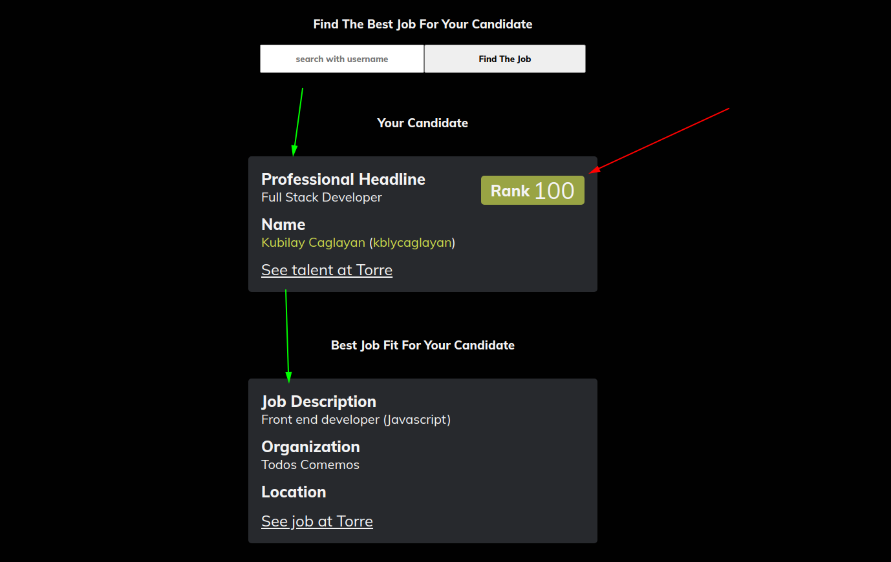
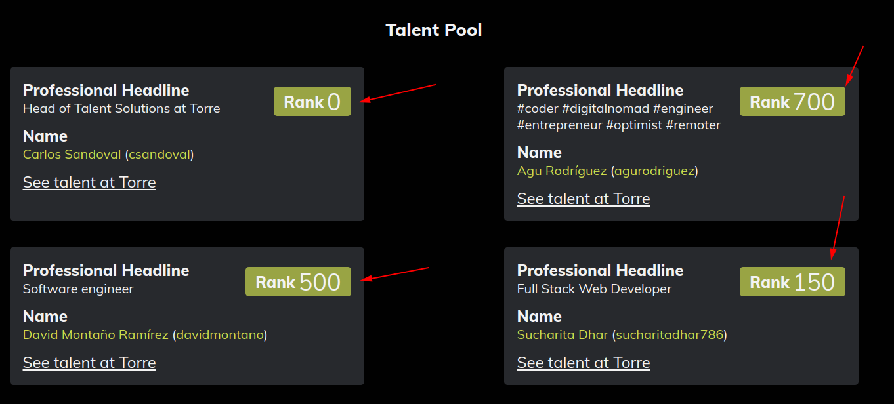

# All For Talent (Torre Technical Test)

- [PROGRESS LOG](https://github.com/kubilaycaglayan/torre-assessment/blob/documentation/PROGRESS.md)

- [COMMIT HISTORY](https://github.com/kubilaycaglayan/torre-assessment/pull/1)

- [VIDEO PRESENTATION](https://www.loom.com/share/4550da5f4948468ba85b8887571eec9a)

- [LIVE LINK](https://all-for-talent.herokuapp.com/)

https://www.loom.com/share/4550da5f4948468ba85b8887571eec9a

> You can use this application to find jobs for your candidates.

> As you are finding the best matching job for your candidate, you also see the ranks of other talents in your talent pool relative to the matching job.

> This gives you a clean sight of your candidates and which one is the best for the matching job.

> Ranks are calculated by the application considering the job and the candidates.

Additional description about the project and its features.

## Built With

- React
- JavaScript
- SASS

## Live

[Live Link](https://all-for-talent.herokuapp.com/)

## Getting Started

### How to Run This Aplication Locally?

Run these commands on the terminal

### Install

- `git clone https://github.com/kubilaycaglayan/torre-assessment.git`
- `cd torre-assessment`
- `git checkout documentation`
- `npm install`

### Usage

- `npm start`

### Run tests

- Due to the time limitations there is no automated tests for this application. It will be considered as the future feature.

## Authors

👤 **Kubilay Caglayan**

- Website: [kubilay](https://kubilaycaglayan.com)
- Github: [@kubilaycaglayan](https://github.com/kubilaycaglayan)
- Twitter: [@kbcaglayan](https://twitter.com/kbcaglayan)
- Linkedin: [linkedin](https://linkedin.com/in/kubilaycaglayan)

## Future Features

- Adding new candidates to the talent pool.
- Automated tests.
- Transition effects for ranks.

## 🤝 Contributing

Contributions, issues, and feature requests are welcome!

Feel free to check the [issues page](issues/).

## Show your support

Give a ⭐️ if you like this project!

## Acknowledgments

- Project built with Torre APIs.
- https://torre.co/

## 📝 License

This project is [MIT](lic.url) licensed.